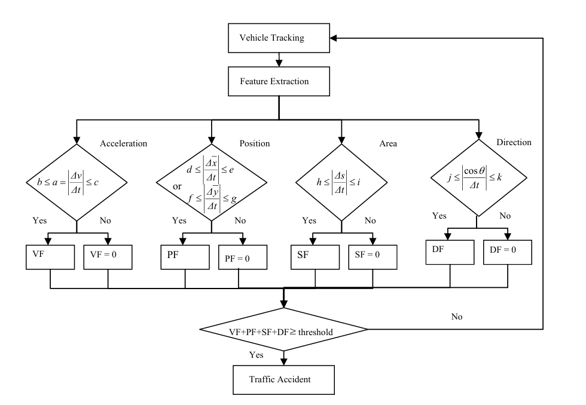
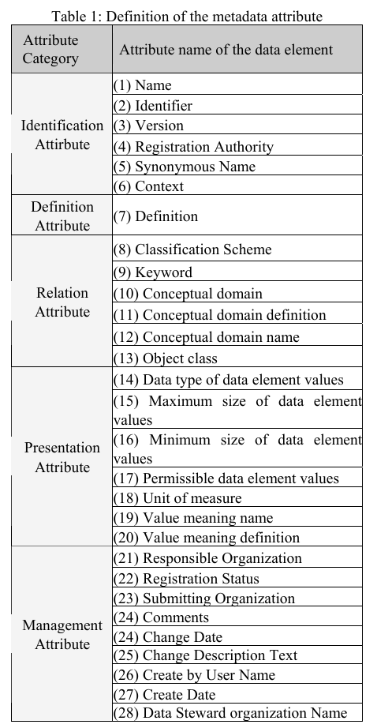

# 第一次周报
### 鲁翰宇 2025/2/8

该阶段我主要研究了一篇关于基于视觉的交通事故检测系统的文章
#### 1. [论文学习](#论文学习)
#### 2. [PythonWeb开发相关技术学习](#PythonWeb开发相关内容学习)

## 论文学习 
我研究的论文是有关基于视觉的交通事故检测系统，其中没有具体的技术细节，
但是有通过图像处理检测事故的算法的基本思路。
### 通过图像处理检测事故的算法  
论文中提到的事故检测算法有三个步骤：车辆提取、运动车辆特征提取、事故检测.
1. 车辆提取与跟踪  
基于差分方法来提取视频帧中的运动物体（主要是车辆）。具体来说，通过计算连续帧之间的差异图像，进行二值化处理，再通过水平和垂直投影分析来提取运动区域。
2. 特征提取  
该部分分为四个小块，根据这四个小块来判断是否发生交通该事故。
- 加速与减速
>⼀般来说，交通事故会导致⻋速快速变化。本文使⽤⻋速变化率
（加速和减速）进⾏事故检测。在跟踪过程中，研究人员提取
了 MV 的速度，计算了⻋辆的正加速度或负加速度，并将其⽤于事故检测
- 位置变化率
>通过提取车辆在图像中的位置变化，分析其质心（重心）的移动，进一步判断是否有异常行为。
- 面积变化率
>通过计算车辆区域的面积变化，来判断是否存在异常。事故发生时，车辆的大小变化通常会较为显著。
- 方向变化率
>参考一帧中提取的部分，通过互相关方法搜索后续帧中对应的部分。跨越两个对应点的运动矢量定义为光流。通过对提取部分中每个像素的正常光流进行平均，得到的平均光流表示为Vn，而通过互相关得到的运动矢量表示为Vi。两个运动矢量之间形成的角度θ可以通过以下方式表示  
$
cos\theta = \frac{V~n~ * V~i~}{|V~n~|*|Vi|}
$  
3. 事故检测算法  

根据流程图建立算法，按照以上步骤进行计算，估算事故指标标志位(VF+PF+SF+DF)之和，判定事故发生
#### 元数据注册
此外，该论文还介绍了他们元数据注册表的设计，这对我们项目的表单管理应该也具有一定的参考价值.
他们的注册表中包含五个类别：  
- 标识属性
- 定义属性
- 关系属性
- 表示属性
- 管理属性  

## PythonWeb开发相关内容学习
本阶段我也进行了PythonWeb开发相关内容的学习，学习成果如下
1. 初步掌握了html文件的编写和bootstrap的运用
2. 能够用JavaScript进行一些简单的事件响应处理
3. 使用Django框架搭建了一个简单的项目，并进行了一些基础的网络编程，初步了解了Web开发流程。
4. 仍有许多内容待学习，后续计划继续深入研究相关技术。
5. 网页做的太丑了就不展示了()

